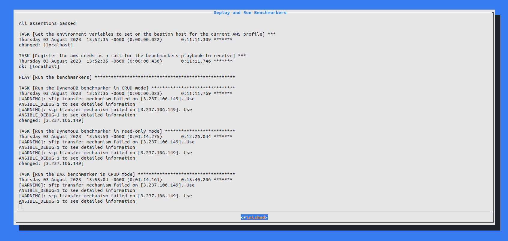

# DynamoDB + DAX Benchmarker
This project houses the Rust and Go code to benchmark the performance of DynamoDB and DAX by simulating heavy loads.





## Features
* [x] Simulate reads on existing data
* [x] Simulate writes
* [x] Simulate updates
* [x] Simulate deletes
* [x] Record the following metrics
  * [x] The type of operation being simulated
  * [x] Total simulation time
  * [x] Read times
  * [x] Write times
  * [x] Confirmation of write times (i.e. how long after a write is the item available when performing a read)
  * [x] Update times
  * [x] Confirmation of update times (i.e. how long after an update is the item available when performing a read)
  * [x] Delete times
  * [x] Confirmation of delete times (i.e. how long after a delete is the item no longer available when performing a read)
* [x] Randomized selection of which operation to perform
* [x] Multithreaded performance for publishing to a locally running Elasticsearch cluster
* [x] Highly performant concurrent operations against DynamoDB - 1,000 concurrent operations
* [x] Read-only scenarios for tables that are likely to be hit with mostly reads and very few mutating operations
* [x] Randomly generate schemas for DynamoDB with a specified number of attributes and generate random data to query

**Disclaimer:** This project exists as a proof-of-concept for how to benchmark and evaluate the performance of DynamoDB + DAX. As such,
this project does not contain any unit tests, integration tests, or E2E tests, thus regressions with future updates are possible and
project stability is _not_ guaranteed in perpetuity.

## Warning!
When making changes to this repository, take extra care to be sure you don't commit the automatically generated variables in
the [hosts file](./ansible/inventories/local/hosts.yml) and in the [host_vars](./ansible/inventories/local/host_vars/localhost.yml).

These files have variables that are populated automatically to make your life easier instead of having to specify variables
all the time. You can remove them manually, or you can wipe away everything and have them removed for you:

* `bastion.hosts.BASTION_HOST_PUBLIC_IP:`
* `vpc_id`
* `dax_endpoint`

## Getting Started

The easiest way to use this project is to use the [benchmarker.sh](./benchmarker.sh) script's TUI. This will automate everything for you and make
the use of this project as painless as possible! Just ensure it's executable and run the TUI:

```shell
chmod +x benchmarker.sh
./benchmarker.sh
```

This project is broken into several distinct pieces. For more information on each the specific pieces, refer to their respective README's:

* [Ansible](./ansible/README.md) -- Go here if you're looking to have more control over what's going on across the entire deployment process, local and AWS
* [CDK](./cdk/README.md) -- Go here if you're looking to discover and tweak the AWS stack and resources

The vast majority of this project is designed to be automated; however, it is also designed to allow the user to customize it as needed. Naturally, customization
is a more challenging course of action here as you'll need to do some of the automated steps manually. I try to detail those steps below.

### Prerequisites
* The commands are being run in a Debian-based Linux environment (i.e. Ubuntu, WSL, etc.)
* [AWS CLI v2](https://docs.aws.amazon.com/cli/latest/userguide/getting-started-install.html) is installed and configured
* Docker is installed (`sudo apt-get update && sudo apt-get install docker-ce docker-ce-cli`)
* The docker compose plugin is installed (`sudo apt-get update && sudo apt-get install docker-compose-plugin`)
* Rust is installed via rustup (`curl --proto '=https' --tlsv1.2 -sSf https://sh.rustup.rs | sh`)
* `jq` is installed (`sudo apt-get install jq`)
* Go is installed ([instructions here](https://go.dev/doc/install))

### Setting up your own local Elastic Stack
Fortunately, setting up the Elastic Stack locally is super easy thanks to [this repository](https://github.com/deviantony/docker-elk).

This setup is automated for you via the `Makefile` target: `init`

It will

* Clone the repository to the folder above the current directory
* Go into the folder
* Start the `setup` docker compose to initialize the Elastic Stack. Don't worry. This function is supposed to exit once it's done initializing your local Elastic Stack

### Starting and Stopping the Elastic Stack
To start the Elastic Stack, you can either manually `cd` into the [docker-elk](../docker-elk) folder and run `docker compose up -d`, or you can use the `start-elastic-stack` target in the [`Makefile`](./Makefile).
Similarly, you can stop the Elastic Stack by either `cd`into the [docker-elk](../docker-elk) folder and running `docker compose down`, or you can use the `stop-elastic-stack` target in the [`Makefile`](./Makefile).

### Running the Benchmarkers
To run the benchmarker, make sure you've done all the following steps so that the AWS SDK can pick up your credentials:

* You're logged into your desired AWS account via the AWS CLI
  * Ensure you're properly connected with `aws sts get-caller-identity`
* You've exported all the following AWS environment variables, so they can be picked up by the AWS SDK at runtime to authenticate with AWS:
  * `AWS_ACCESS_KEY_ID`
  * `AWS_SECRET_ACCESS_KEY`
  * `AWS_SESSION_TOKEN`
  * `AWS_REGION` (not typically defined by the CLI)
  * `AWS_ACCOUNT` (this is a special variable that is not normally defined by the AWS CLI: definition is achieved by running `export AWS_ACCOUNT=$(aws sts get-caller-identity | jq -r .Account)`)
  * A nifty little shortcut for exporting all but the `AWS_REGION` and `AWS_ACCOUNT` variables is provided with the following command: ```shell eval $(aws configure export-credentials --format env)```

There's a few ways to run the benchmarkers, but the easiest is to build them and run their binaries.

It's as simple as `make build` and running whichever binary that corresponds to the benchmarking you wish to perform; e.g.
* `./dynamodb-benchmarker`
or
* `./dax-benchmarker`

For both the `dynamodb-benchmarker` and the `dax-benchmarker`, additional help and usage flags can be found using `--help`. This way you can tweak your benchmarking experience as necessary.

**dynamodb-benchmarker help**:
```
atusa@atusa-thinkpad:~/code/dynamodb-benchmarker$ ./dynamodb-benchmarker --help
A CLI tool for simulating heavy usage against DynamoDB and publishing metrics to an Elastic Stack for analysis

Usage: dynamodb-benchmarker [OPTIONS]

Options:
  -c, --concurrent-simulations <CONCURRENT_SIMULATIONS>
          The number of concurrent simulations to run [default: 1000]
  -a, --attributes <ATTRIBUTES>
          The number of attributes to use when populating and querying the DynamoDB table; minimum value of 1 [default: 5]
  -d, --duration <DURATION>
          The length of time (in seconds) to run the benchmark for [default: 1800]
  -b, --buffer <BUFFER>
          The buffer size of the Elasticsearch thread's MPSC channel [default: 500]
  -u, --username <USERNAME>
          Local Elasticsearch cluster username [default: elastic]
  -p, --password <PASSWORD>
          Local Elasticsearch cluster password [default: changeme]
  -i, --index <INDEX>
          The Elasticsearch Index to insert data into [default: dynamodb]
  -t, --table-name <TABLE_NAME>
          The DynamoDB table to perform operations against [default: atusa-high-velocity-table]
  -r, --read-only
          Whether to run a read-only scenario for benchmarking
  -h, --help
          Print help
  -V, --version
          Print version
```

**dax-benchmarker help**:
```
atusa@atusa-thinkpad:~/code/dynamodb-benchmarker$ ./dynamodb-benchmarker --help
A CLI tool for simulating heavy usage against DAX and publishing metrics to an Elastic Stack for analysis

Usage:
  dax-benchmarker [flags]

Flags:
  -a, --attributes int               The number of attributes to use when populating and querying the DynamoDB table; minimum value of 1 (default 5)
  -b, --buffer int                   The buffer size of the Elasticsearch goroutine's channel (default 500)
  -c, --concurrent-simulations int   The number of concurrent simulations to run (default 1000)
  -d, --duration int                 The length of time (in seconds) to run the bechmark for (default 1800)
  -e, --endpoint string              The DAX endpoint to hit when running simulations (assumes secure endpoint, so do not specify port)
  -h, --help                         help for dax-benchmarker
  -i, --index string                 The Elasticsearch Index to insert data into (default "dax")
  -p, --password string              Local Elasticsearch cluster password (default "changeme")
  -r, --read-only                    Whether to run a read-only scenario for benchmarking
  -t, --table string                 The DynamoDB table to perform operations against (default "atusa-high-velocity-table")
  -u, --username string              Local Elasticsearch cluster username (default "elastic")
```

#### DAX Benchmarker Gotcha
The nature of DAX os that it does not allow external access from outside the VPC it is deployed in. This is due to the
fact that DAX uses a proprietary protocol that does not support TLS. So, in order to run the DAX benchmarker, we must
push it out and run it from the bastion host that is created in the CDK. This is why the host is created.

To do this manually, you need to know a few pieces of information:

* The SSH key used to connect to the host -- if you did not specify a key manually, then the key is `~/.ssh/$USER-dax-pair.pem`
* The bastion host's public IP address
* The DAX endpoint URI

The bastion host's public IP and the DAX Endpoint can be obtained using the following commands 
(You'll need to copy/paste the DAX endpoint once you've SSH'd into the bastion host):

```shell
dax_endpoint=$(aws cloudformation describe-stacks --stack-name "$USER-dax-benchmark-stack" --query "Stacks[0].Outputs[?OutputKey=='DaxEndpoint'].OutputValue" --output text)
bastion_host_ip=$(aws cloudformation describe-stacks --stack-name "$USER-dax-benchmark-stack" --query "Stacks[0].Outputs[?OutputKey=='InstancePublicIp'].OutputValue" --output text)
```

Then, you need to upload the `dax-benchmarker` binary to the bastion host:
```shell
scp -i ~/.ssh/"$USER"-dax-pair.pem dax-benchmarker ec2-user@"$bastion_host_ip":/home/ec2-user/
```

Additionally, you'll need to configure the bastion host to use your current AWS CLI creds; so you'll need to run the following
command locally and paste the output exactly into the SSH session:
```shell
aws configure export-credentials --format env
```

Finally, you need to SSH into the bastion host with remote port forwarding to your local Elasticsearch cluster (port 9200):
```shell
ssh -i ~/.ssh/"$USER"-dax-pair.pem -R 9200:localhost:9200 ec2-user@"$bastion_host_ip"
```

Once you're SSH'd into the bastion host, you'll need to set the `DAX_ENDPOINT` environment variable using the DAX endpoint spit out
by the previous command:

```shell
export DAX_ENDPOINT='PASTE_DAX_ENDPOINT_HERE'
```

Be sure to paste the output of the `aws configure export-credentials --format env` command as well

Finally, be sure to also export the `AWS_REGION` environment variable that matches the region you deployed your stack into.

Once you've done all of this, you're ready to run the `dax-benchmarker` from the bastion host and customize the experience however you need using the
configuration parameters provided (`./dax-benchmarker -h`).

### Scenarios
By default, for both benchmarkers, they perform CRUD simulations that randomly choose to
* Read an existing item
* Write a new item and record how long it takes to confirm it's there (deletes the item afterward)
* Create a new item and update it, then record how long it takes to confirm the update is reflected in subsequent API calls (deletes the item afterward)

However, sometimes a more realistic test is to simply run in `read-only` mode; This is supported by both benchmarkers via the `-r, --read-only` flag.

`read-only` mode, for each concurrent simulation, randomly select a time between 0 and 15 seconds, and then execute a read on an existing item. This simulates more realistic behavior from applications
who are only reading from DAX or DynamoDB and not performing any write, update, or delete operations.

## Accessing the Elastic Stack and analyzing data
By default, the Elastic Stack services are at the following URLs when running locally:

* Elasticsearch -> `http://localhost:9200`
* Kibana -> `http://localhost:5601`

The default credentials for accessing them are

* Username -> `elastic`
* Password -> `changeme`

Once you're in, you can use Kibana to analyze the data published by the benchmarker. 

This data lives in the `dynamodb` and the `dax` indices of Elasticsearch by default, unless specified otherwise on the clients by the user.

**Note:** Sometimes the simulations would reach the provisioned throughput thresholds and would be rate-limited by AWS. I set the DynamoDB table to On-Demand 
to scale out automatically, however this does not always prevent being rate limited. So that is why I also track the Failed Simulations in the Kibana graphs.

## Populating the DynamoDB benchmarking table with random data
By default, the clients and CDK create a DynamoDB table titled `$USER-high-velocity-table`. To run the clients with a different table name, use the `-t, --table` arguments.

If you wish to populate the table with some data, the easiest way to achieve this is via the [randomly-generate-high-velocity-data](./scripts/randomly-generate-high-velocity-data.sh) script. 
Simply run it and specify the number of items you wish to populate (rounded to a multiple of 25) via `-i 50`!

To follow the progress of the script, tail the `/tmp/benchmarker.log` file.

You can specify different arguments to the script to tweak the settings for the script as necessary:

```
atusa@atusa-thinkpad:~/code/dynamodb-benchmarker$ ./scripts/randomly-generate-high-velocity-data.sh --help
randomly-generate-high-velocity-data: A script to randomly generate high-velocity data for some DynamoDB table with random attributes and values for benchmarking purposes.

USAGE:
  randomly-generate-high-velocity-data [OPTIONS] [ARGS]...

  -h, --help                           Show this usage screen

ARGS:
  -a, --attributes <ATTRIBUTES>        The number of attributes to populate each item in the table with
                                       This defaults to 5

  -i, --items      <ITEMS>             The number of items to populate the table with
                                       Items are populated 25 at a time, so whatever number you provide will be rounded to the nearest multiple of 25

  -t, --table      <TABLE_NAME>        The name of the DynamoDB table to populate
                                       This defaults to atusa-high-velocity-table

```

These arguments are provided as a convenience to the user if they so wish to populate a table other than the default one created by the CDK.

## Troubleshooting
In the event you need more information about any of the automation, you can check the various log files created throughout the application:

* `/tmp/ansible-playbook-output.log` -- Generated whenever ansible-playbooks are run from the TUI
* `/tmp/benchmarker.log` -- Generated whenever you run the `randomly-generate-high-velocity-data.sh` script outside the TUI
* `/tmp/benchmarker-tui.log` -- Generated by events in the TUI
* `/tmp/dynamodb-population.log` -- Generated whenever you run the `randomly-generate-high-velocity-data.sh` script from the TUI